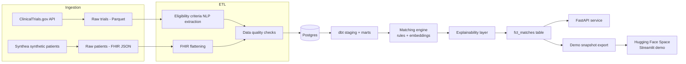

# TrialMatch — End-to-End Clinical Trial Matching Pipeline

TrialMatch ingests real clinical trial data and synthetic patient records, runs them through
an orchestrated ETL + NLP pipeline, and produces **explainable** trial recommendations for
each patient. It is designed to demonstrate production-style data engineering, not just a
matching algorithm.

**Live demo (Hugging Face Space):** [link to your Space here]
**Full pipeline (this repo):** ingestion → ETL/NLP → dbt modeling → matching → API

---

## Why this project exists

Most "clinical matching" projects are a notebook with a similarity score. TrialMatch instead
shows the full lifecycle a real healthcare data platform needs:

- Ingesting messy real-world data (unstructured eligibility criteria text) and synthetic
  patient records (structured FHIR) from two very different sources
- Orchestrated, testable ETL rather than ad-hoc scripts
- A modeled warehouse layer (dbt) instead of one giant dataframe
- Matching logic that is **auditable** — every match ships with the reasons it passed or failed
- A clean separation between the heavy pipeline (this repo) and a lightweight, always-on
  demo (Hugging Face Space) that serves a precomputed snapshot

## Architecture



## Tech stack

| Layer            | Tool                                   |
|-------------------|-----------------------------------------|
| Orchestration     | Prefect                                 |
| Warehouse modeling| dbt + Postgres                          |
| NLP extraction    | spaCy / scispaCy                        |
| Semantic ranking  | sentence-transformers                   |
| Serving           | FastAPI                                 |
| Demo UI           | Streamlit (deployed separately on HF)   |
| Data quality      | Great Expectations-style custom checks  |
| Packaging         | Docker + docker-compose                 |

## Repository structure

```
github-repo/
├── src/trialmatch/
│   ├── ingestion/     # pulls trials from the API, loads Synthea patient output
│   ├── etl/            # FHIR flattening, NLP criteria extraction, data quality checks
│   ├── matching/       # rules engine, embedding-based ranking, explainability
│   ├── db/             # SQLAlchemy models + session management
│   ├── api/             # FastAPI serving layer
│   └── flows/           # Prefect flow that wires everything together
├── dbt/trialmatch_dbt/ # staging + mart models on top of raw Postgres tables
├── scripts/             # one-off scripts, incl. exporting the demo snapshot for HF Spaces
├── tests/                # pytest unit tests for the pure-logic pieces
├── data/                 # raw / processed / sample data (gitignored except sample/)
└── docker-compose.yml   # Postgres + API, one command to stand up the stack
```

## Running it locally

```bash
cp .env.example .env
docker compose up -d postgres          # start the database
pip install -r requirements.txt

# 1. Ingest
python -m trialmatch.ingestion.fetch_trials --condition "breast cancer" --max-studies 200
python -m trialmatch.ingestion.generate_patients --count 500   # requires Synthea, see below

# 2. ETL
python -m trialmatch.etl.parse_fhir
python -m trialmatch.etl.extract_criteria
python -m trialmatch.etl.data_quality

# 3. Model the warehouse
cd dbt/trialmatch_dbt && dbt run && cd ../..

# 4. Match
python -m trialmatch.matching.rules_engine
python -m trialmatch.matching.embeddings

# 5. Serve
uvicorn trialmatch.api.main:app --reload
```

Or run the whole thing as a single Prefect flow:

```bash
python -m trialmatch.flows.pipeline_flow
```

### Getting synthetic patients (Synthea)

Synthea is a Java tool that generates realistic-but-fake patient records (FHIR format) with
no real PHI. See [Synthea's repo](https://github.com/synthetichealth/synthea) for the jar.
`generate_patients.py` shells out to it and then loads the resulting FHIR bundles.

## Running tests

```bash
pytest tests/
```

## Exporting the demo snapshot

The Hugging Face Space does **not** run Prefect/Postgres/dbt live — it serves a static,
precomputed snapshot of matches so the demo is instant and free to host. After a full
pipeline run:

```bash
python scripts/export_demo_snapshot.py --out ../huggingface-space/data
```

## Resume summary

> Built an end-to-end clinical trial matching pipeline processing real ClinicalTrials.gov
> data and synthetic FHIR patient records; orchestrated ingestion and ETL with Prefect,
> modeled the warehouse with dbt, extracted eligibility criteria with NLP, and served
> explainable, auditable trial matches via FastAPI, with an interactive demo deployed on
> Hugging Face Spaces.

## License

MIT — see [LICENSE](LICENSE).
